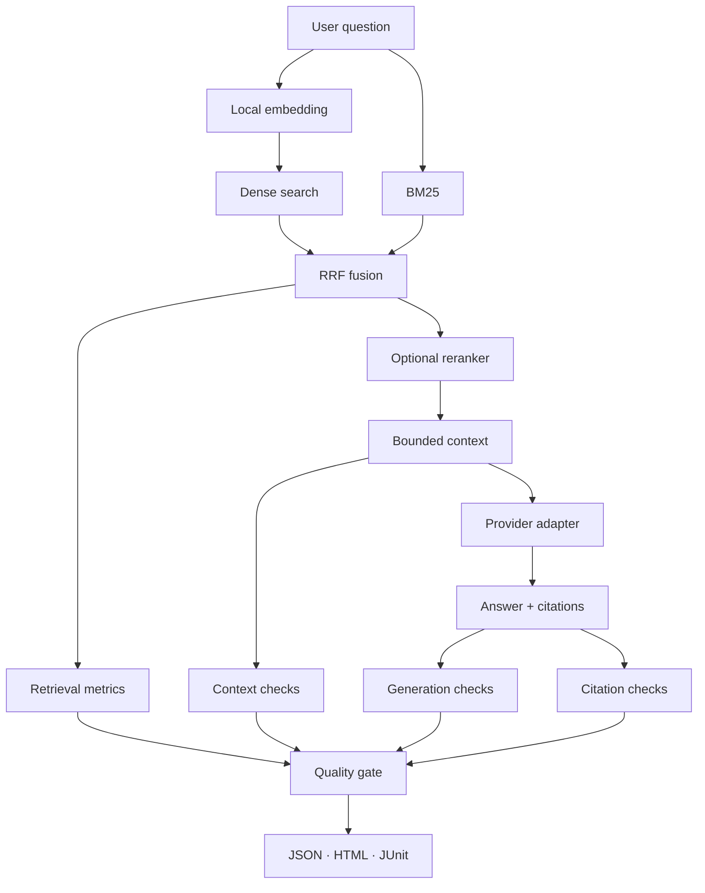

# RAG & LLM Evaluation Lab

An enterprise-style reference implementation for building and systematically evaluating Retrieval-Augmented Generation applications across retrieval quality, context quality, groundedness, hallucination, citation accuracy, latency, token usage, cost and regression quality.

> A RAG answer can look fluent and still be wrong.

[](https://github.com/ashokmanohar-ai/rag-llm-evaluation-lab/actions/workflows/ci.yml)
[](https://github.com/ashokmanohar-ai/rag-llm-evaluation-lab/actions/workflows/rag-regression.yml)

## 📄 Technical White Paper

**[RAG Quality Engineering: A Practical Framework for Evaluating Retrieval-Augmented Generation Systems](WHITEPAPER.md)**

A practitioner-focused white paper on evaluating RAG as a layered engineering system rather than judging only final-answer fluency. It covers retrieval metrics, chunking, hybrid search, reranking, context sufficiency, groundedness, hallucination, citation integrity, prompt injection, authorization, freshness, performance, cost, observability, regression testing and CI/CD quality gates.

> **Core principle:** prove that the right evidence was retrieved, authorized, current, preserved in context, correctly used by the model, and traceable through valid citations.

Citation metadata is available in [`CITATION.cff`](CITATION.cff).

## Recruiter quick tour

> **60-second decision:** this repository proves end-to-end RAG evaluation engineering—separating retrieval, context, generation, citation, cost, latency, and regression quality instead of judging only whether an answer sounds fluent.

| Recruiter signal | Evidence in this repository |
| --- | --- |
| Evaluation depth | Precision@K, Recall@K, MRR, NDCG, context sufficiency, groundedness, hallucination, citation accuracy, latency, tokens, and cost |
| Engineering design | Hybrid BM25 + dense retrieval, optional reranking, bounded context, provider adapters, versioned datasets, and hard quality gates |
| Reproducibility | Credential-free evaluation paths, JSON/HTML/JUnit evidence, Docker, CI, and measured baselines |
| Interview path | [Architecture](docs/architecture.md) → [validation report](docs/validation-report.md) → [2- and 5-minute walkthrough](docs/interview-walkthrough.md) |

**Five-minute proof:** follow the [quick start](#quick-start), run the retrieval and QA datasets, then compare the generated case-level evidence with the configured release thresholds.

This repository demonstrates both halves of production RAG engineering:

- Build: safe ingestion, versioned metadata, fixed/recursive chunking, dense retrieval, BM25, Reciprocal Rank Fusion, optional reranking, bounded context, grounded generation and traceable citations.
- Prove: retrieval metrics, required-fact checks, groundedness, hallucination detection, citation validation, latency/tokens/cost, repeated-run stability, baselines, regression gates and case-level diagnostics.

It is intentionally not a chat-with-PDF demo, notebook experiment, or wrapper around one evaluation library.

## Why RAG evaluation matters

A good final answer can hide poor retrieval; good retrieval can still feed a hallucinating model. This lab evaluates each boundary independently:

| Layer | Questions answered | Measures |
|---|---|---|
| Retrieval | Was the right evidence found and ranked? | Precision@K, Recall@K, Hit@K, MRR, NDCG |
| Context | Is evidence sufficient, ordered and token-efficient? | Recall, redundancy, budget drops, utilisation proxy |
| Generation | Is the answer correct, complete and supported? | Required facts, relevance, groundedness, hallucination |
| System | Is evidence traceable and behaviour releasable? | Citation checks, latency, tokens, cost, stability, regression |

## Architecture



The default pull-request path is fully offline: deterministic hashing embeddings, local dense/BM25 retrieval, lexical reranking, extractive mock generation and deterministic evaluators. Install `.[ml]` to use `all-MiniLM-L6-v2`, FAISS and a CrossEncoder. The mock path validates framework behaviour; it is never presented as evidence of real-model quality.

## Key features

- 24 original Acme Employee Support documents with version, status, region, department and access-group metadata.
- 80 meaningful cases: 25 retrieval, 25 QA, 10 hallucination, 10 citation and 10 adversarial.
- Fixed and heading-aware recursive chunking with stable document/chunk IDs.
- Preferred local `all-MiniLM-L6-v2`/FAISS adapter plus deterministic CI fallback.
- Transparent BM25 and hybrid search using configurable Reciprocal Rank Fusion.
- Lexical CI reranker and optional CrossEncoder adapter.
- Current-document filtering; superseded and draft sources are excluded by default.
- Bounded, deduplicated context with explicit dropped-chunk traceability.
- Mock, Azure OpenAI, OpenAI-compatible and optional Anthropic provider adapters.
- Deterministic fact, hallucination, groundedness and citation checks; structured judge contract.
- Baselines, declarative quality gates and matching-dataset regression comparison.
- Console, JSON, HTML and JUnit output with reason codes and per-case evidence.
- FastAPI, Typer CLI, non-root Docker image and three GitHub Actions workflows.
- Optional OpenTelemetry/Phoenix-compatible instrumentation facade.

## Quick start

Prerequisites: Python 3.12+.

```bash
python -m venv .venv
source .venv/bin/activate
python -m pip install -e '.[dev]'
```

Windows PowerShell activation is `.venv\Scripts\Activate.ps1`.

Build the index manifest, ask a question, and evaluate:

```bash
rag-eval index build
rag-eval query "How many days of annual leave do employees receive?"
rag-eval run --dataset data/evaluation/retrieval.jsonl
rag-eval run --dataset data/evaluation/qa.jsonl
```

Create and compare a measured baseline:

```bash
rag-eval baseline create --dataset data/evaluation/qa.jsonl
rag-eval baseline compare --dataset data/evaluation/qa.jsonl
```

Run configuration experiments:

```bash
rag-eval benchmark
```

Generated output is written to `reports/evaluation.json`, `reports/evaluation.html`, `reports/junit.xml`, and `reports/failures.json`.

## API

```bash
uvicorn rag_eval.api.app:app --reload --port 8080
```

```bash
curl -sS http://localhost:8080/health
curl -sS -X POST http://localhost:8080/api/v1/query \
  -H 'Content-Type: application/json' \
  -d '{"question":"How long is a temporary password valid?"}'
```

Endpoints:

| Method | Path | Purpose |
|---|---|---|
| `POST` | `/api/v1/query` | Grounded query with citations and stage timings |
| `POST` | `/api/v1/evaluate` | Run an approved local JSONL dataset |
| `GET` | `/api/v1/evaluations/{id}` | Read evaluation status |
| `GET` | `/api/v1/reports/{id}` | Download the HTML report |
| `POST` | `/api/v1/index/rebuild` | Rebuild after API-key validation |

OpenAPI documentation is available at `http://localhost:8080/docs`.

## Retrieval and context design

Dense retrieval and BM25 are evaluated separately before Reciprocal Rank Fusion:

\[
\operatorname{RRF}(d)=\sum_{r \in R}\frac{1}{k+\operatorname{rank}_r(d)}
\]

The default `k` is 60. RRF combines rankings rather than incomparable raw dense and BM25 scores. Reranking can take 20 candidates and return five final chunks. The context builder preserves source IDs, removes near duplicates, applies a configurable token budget and records every dropped chunk.

## Evaluation datasets

```text
data/
├── knowledge/{finance,hr,it,security,support,travel}/
├── evaluation/
│   ├── retrieval.jsonl       # expected documents and chunks
│   ├── qa.jsonl              # reference facts, sources, forbidden claims
│   ├── hallucination.jsonl   # supported and unsupported claims
│   ├── citations.jsonl       # valid, missing, wrong and invented citations
│   └── adversarial.jsonl     # injection, version, region and scope cases
└── baselines/                # measured baselines only
```

Retrieval metrics are deterministic. Known facts use normalized fact coverage. Citation existence is checked against real chunk IDs. LLM-as-a-judge is reserved for genuinely semantic dimensions and must return a versioned structured result; it cannot override factual failures.

## Quality gates and regression

`config/quality-gates.yaml` defines minimum quality, maximum hallucination and non-blocking latency thresholds. A release fails on critical correctness or evidence problems. Latency may be configured as a warning. Baseline comparison rejects different datasets so configuration comparisons remain meaningful.

Never replace a baseline simply to make a change pass. Record the dataset, configuration, creation time and measured metrics, then review the change.

## Embeddings, models and cost

`config/models.yaml` keeps model pricing outside source code. Cost is calculated only when a provider returns token counts and configured prices are available; missing usage is reported as unknown, never invented. Model-generated confidence is exposed only as provider metadata and is not a probability of correctness.

Provider mode is explicit:

```bash
cp .env.example .env
export EMBEDDING_PROVIDER=sentence_transformers
export LLM_PROVIDER=azure_openai
```

No secrets are committed, and normal CI never calls a paid model.

## Observability

The optional observability extra provides OpenTelemetry-compatible spans and a Phoenix endpoint. Recommended spans are request, embedding, dense retrieval, sparse retrieval, fusion, reranking, context assembly, generation and evaluation. Trace metadata records configuration and timing but avoids secrets and full sensitive document content.

```bash
python -m pip install -e '.[observability]'
docker compose --profile observability up --build
```

## Docker

```bash
docker build -t rag-llm-evaluation-lab .
docker run --rm -p 8080:8080 rag-llm-evaluation-lab
```

Or:

```bash
docker compose up --build
```

The service runs as a non-root user, defaults to mock/hash modes and exposes a health check.

## CI/CD

- `ci.yml`: install, lint, format, strict typing, tests, offline index/query and Docker build.
- `rag-regression.yml`: retrieval/QA evaluation, baseline comparison and report artifact.
- `benchmark.yml`: manual dense/hybrid/reranker/top-k comparison so expensive experiments do not run on every PR.

## Security

The loader accepts only local Markdown/text files, rejects traversal and oversized files, and does not fetch arbitrary URLs. Metadata filters demonstrate region/access scoping. Adversarial knowledge contains a prompt- and citation-injection string to prove document content remains untrusted. See [SECURITY.md](SECURITY.md).

## Repository map

```text
src/rag_eval/
├── ingestion/       # safe loader, chunking, metadata policy
├── embeddings/      # hashing and sentence-transformer adapters
├── retrieval/       # dense, BM25, RRF and hybrid search
├── reranking/       # lexical and optional CrossEncoder
├── generation/      # provider contract, mock and hosted adapters
├── pipeline/        # retrieval → context → answer → citation flow
├── evaluation/      # retrieval, generation, citation, performance, judge
├── regression/      # baselines, comparison and quality gates
├── reporting/       # console, JSON, HTML and JUnit
├── observability/   # trace and metric facades
├── api/             # FastAPI
└── cli/             # Typer
```

## Validation

```bash
ruff check .
ruff format --check .
mypy src tests
pytest
rag-eval index build
rag-eval run --dataset data/evaluation/retrieval.jsonl
rag-eval run --dataset data/evaluation/qa.jsonl
```

## Limitations

- The synthetic corpus proves framework behaviour, not production relevance on another organisation's data.
- Hash embeddings and the extractive mock are deterministic CI substitutes, not quality proxies for MiniLM or a real LLM.
- Deterministic groundedness uses controlled textual evidence; open-domain semantic claims should add a calibrated judge and human review.
- The in-memory API evaluation registry is suitable for a lab; production needs durable jobs, authentication, rate limits and tenant-aware storage.
- FAISS is local and process-sized. Large deployments should use an access-aware managed search layer and re-run this evaluation suite against it.

## Roadmap

- Calibrated RAGAS and DeepEval adapters behind optional extras.
- Query-rewrite and multilingual evaluation experiments.
- Durable evaluation jobs and signed report provenance.
- Access-control fixtures for tenant/project isolation.
- Connectors for Azure AI Search, OpenSearch and pgvector.

## Interview walkthrough

Start with retrieval failures, show one case-level report, then demonstrate how the same dataset compares dense, hybrid and reranked configurations. Explain why deterministic checks own facts/citations and why model judges are restricted to semantic questions. The full two- and five-minute narrative is in [docs/interview-walkthrough.md](docs/interview-walkthrough.md).

## Documentation

- [Architecture](docs/architecture.md)
- [RAG design](docs/rag-design.md)
- [Retrieval evaluation](docs/retrieval-evaluation.md)
- [LLM evaluation](docs/llm-evaluation.md)
- [Citation evaluation](docs/citation-evaluation.md)
- [Hallucination testing](docs/hallucination-testing.md)
- [Regression testing](docs/regression-testing.md)
- [Observability](docs/observability.md)
- [CI/CD](docs/ci-cd.md)
- [Validation report](docs/validation-report.md)
- [Enterprise extensions](docs/enterprise-extensions.md)
- [Interview walkthrough](docs/interview-walkthrough.md)

## Contributing and licence

See [CONTRIBUTING.md](CONTRIBUTING.md). Licensed under the [MIT License](LICENSE).
