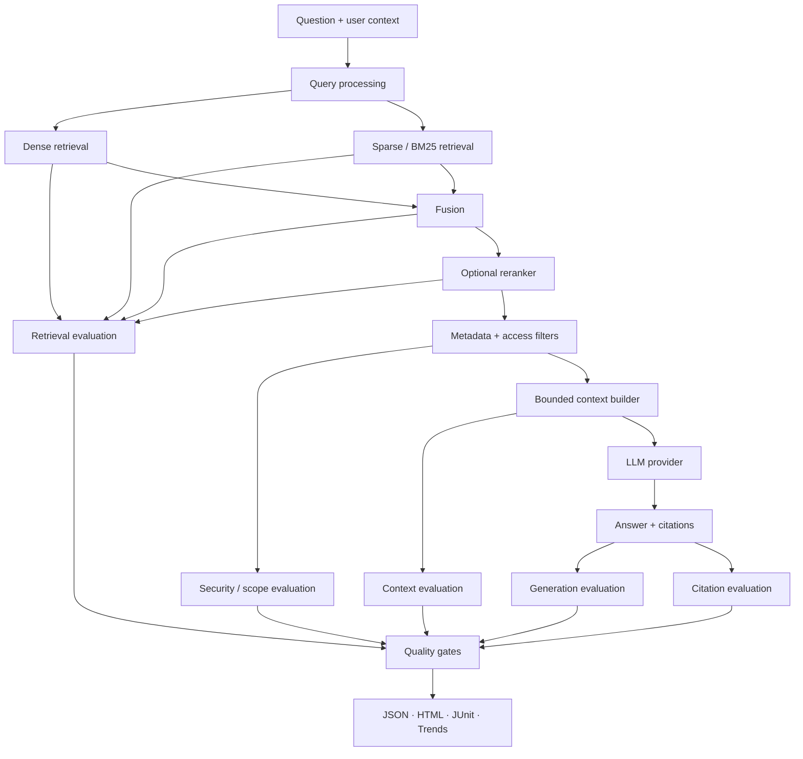

# RAG Quality Engineering

## A Practical Framework for Evaluating Retrieval-Augmented Generation Systems

**Technical White Paper — Version 1.0**  
**September 2026**

**Author:** Ashok Kumar Manohar  
**GitHub:** [ashokmanohar-ai](https://github.com/ashokmanohar-ai)  
**Reference implementation:** [RAG & LLM Evaluation Lab](https://github.com/ashokmanohar-ai/rag-llm-evaluation-lab)

> **Publication note:** This is an independent technical white paper supported by an open-source reference implementation. It is not a peer-reviewed academic publication, security certification, compliance certification, or statement of production readiness.

---

## Abstract

Retrieval-Augmented Generation (RAG) has become a practical architecture for grounding large language model applications in enterprise knowledge. Yet the quality of a RAG system cannot be established by reading a few fluent answers. A response may sound correct while the retriever found the wrong evidence, stale content entered the context window, relevant facts were omitted, citations were invented, access-control boundaries were bypassed, or the generator added unsupported claims.

This white paper presents **RAG Quality Engineering** as an evidence-driven discipline for testing retrieval, context construction, generation, citation, security, performance, cost, and regression behavior as separate but connected quality surfaces. It argues that RAG evaluation should be designed as an engineering system with versioned datasets, deterministic metrics where possible, calibrated model-based evaluation where necessary, traceable evidence, reproducible baselines, adversarial testing, and release gates integrated into CI/CD.

The paper proposes a layered evaluation model covering **retrieval quality, context quality, answer quality, citation integrity, security and access control, operational quality, and release confidence**. It also introduces practical methods for evaluating dense, sparse, hybrid and reranked retrieval; measuring precision, recall, MRR and NDCG; detecting hallucination and unsupported claims; validating citations; testing prompt injection in retrieved content; evaluating freshness and metadata filtering; measuring latency and cost; and preventing quality regressions when embeddings, prompts, models, chunking strategies or indexes change.

A companion open-source reference implementation demonstrates hybrid BM25 + dense retrieval, Reciprocal Rank Fusion, optional reranking, bounded context, versioned datasets, deterministic and semantic evaluators, hallucination and citation checks, baselines, quality gates, JSON/HTML/JUnit reports, Docker, FastAPI, OpenTelemetry-ready observability, and GitHub Actions regression workflows.

The central proposition is:

> **A trustworthy RAG system must prove not only that an answer is useful, but that the right evidence was retrieved, the evidence was authorized and current, the answer remained grounded in that evidence, citations were valid, and quality remained stable across change.**

---

## 1. Executive Summary

RAG systems sit at the intersection of search, data engineering, application security, prompt engineering and generative AI. This makes them fundamentally multi-stage systems.

A typical RAG flow is:

```text
User Question
   ↓
Query Processing
   ↓
Retrieval
   ↓
Ranking / Reranking
   ↓
Context Assembly
   ↓
LLM Generation
   ↓
Answer + Citations
```

Every stage can fail independently.

Examples include:

- a relevant document is never retrieved;
- a correct document is retrieved but ranked below irrelevant content;
- superseded policy content outranks the current version;
- context truncation removes the decisive fact;
- duplicate chunks consume the context budget;
- the model ignores retrieved evidence;
- the model adds a plausible but unsupported statement;
- a citation points to the wrong source;
- malicious instructions inside retrieved content alter model behavior;
- restricted documents are returned to the wrong user;
- a model or embedding upgrade silently lowers retrieval quality;
- latency or token cost becomes unacceptable even while accuracy improves.

Therefore, evaluating only the final answer creates a dangerous blind spot.

A production-grade RAG quality program should answer seven questions:

1. **Retrieval:** Did the system find the right evidence?
2. **Context:** Did the system assemble enough high-quality evidence within budget?
3. **Generation:** Did the model answer correctly and only from supported evidence?
4. **Citations:** Can claims be traced to valid sources?
5. **Security:** Was retrieval restricted to authorized, trustworthy content?
6. **Operations:** Was the result delivered with acceptable latency, stability and cost?
7. **Regression:** Did a system change improve quality without breaking another dimension?

The recommended operating principle is **deterministic-first, evidence-first evaluation**. Ranking metrics, source IDs, metadata rules, citation existence, forbidden claims, latency and token counts should be tested deterministically whenever possible. Model-based judges should be reserved for semantic properties that cannot be reliably reduced to exact rules, and they should themselves be calibrated and versioned.

---

## 2. Why RAG Quality Engineering Is Different

Traditional application testing usually compares deterministic input/output behavior. Search evaluation focuses on document relevance. LLM evaluation focuses on generated responses. RAG combines all three while adding data freshness, metadata filtering, context limits and security boundaries.

That combination means the same visible symptom can have multiple root causes.

For example, if an answer omits a policy exception:

- the document may not have been ingested;
- chunking may have split the exception from its heading;
- the retriever may have missed the relevant chunk;
- the relevant chunk may have been retrieved but ranked too low;
- the context budget may have dropped it;
- the model may have ignored it;
- the answer evaluator may have failed to notice the omission.

A mature test strategy must isolate these failure modes rather than labeling all of them as “LLM hallucination.”

---

## 3. A Layered RAG Quality Model

The proposed model separates seven quality layers.

| Layer | Core question | Example measures |
|---|---|---|
| Retrieval | Was the right evidence found and ranked? | Precision@K, Recall@K, Hit@K, MRR, NDCG |
| Context | Was the evidence sufficient and efficient? | context recall, redundancy, token utilization, dropped evidence |
| Generation | Is the answer correct and grounded? | required-fact coverage, groundedness, unsupported claims, relevance |
| Citation | Can the answer be traced to valid evidence? | citation precision, citation recall, source existence, claim-source alignment |
| Security | Was evidence authorized and trustworthy? | access filtering, injection resistance, poisoning checks, tenant isolation |
| Operations | Is the system usable at scale? | latency, throughput, error rate, tokens, cost, stability |
| Regression | Did change preserve or improve quality? | baseline deltas, hard gates, statistical stability, failure clusters |

This layered view is important because aggregate scores can hide critical failures. A system with excellent answer relevance but weak access control is not acceptable. A system with strong retrieval but fabricated citations is not trustworthy. A system with high average quality but severe failures on high-risk questions may still be unreleasable.

---

## 4. Reference Architecture for Evaluation



The evaluation system should capture evidence at every boundary:

- query and normalized query;
- candidate document/chunk IDs;
- ranks and retrieval scores;
- metadata filters applied;
- reranker outputs;
- chunks admitted to or dropped from context;
- prompt/model/configuration versions;
- answer and citations;
- latency by stage;
- token usage and cost where available;
- evaluator results and reason codes.

Without this evidence, debugging becomes guesswork.

---

## 5. Start With a Versioned Evaluation Dataset

A RAG test suite is only as credible as its evaluation data.

Each evaluation case should contain enough structure to test the intended layer. A practical case can include:

```json
{
  "id": "HR-LEAVE-001",
  "question": "How many days of annual leave do employees receive?",
  "expected_sources": ["hr-leave-policy-v3"],
  "required_facts": ["25 days"],
  "forbidden_claims": ["30 days"],
  "user_context": {
    "region": "UK",
    "access_group": "employee"
  },
  "tags": ["hr", "policy", "retrieval", "grounding"],
  "dataset_version": "1.0"
}
```

A strong dataset should include:

- easy factual questions;
- multi-document synthesis;
- near-duplicate documents;
- stale versus current versions;
- ambiguous wording;
- negative questions where the answer is absent;
- restricted content;
- region-specific content;
- conflicting documents;
- long-context questions;
- citation-sensitive questions;
- adversarial and prompt-injection cases;
- high-risk domain questions;
- multilingual or rewritten queries where relevant.

The dataset should be reviewed like production test code: versioned, peer-reviewable, reproducible and tied to business risk.

---

## 6. Retrieval Evaluation

Retrieval must be evaluated independently of generation. If the generator never receives the right evidence, no prompt can reliably compensate.

### 6.1 Precision@K

Precision@K measures how many of the top K retrieved items are relevant.

\[
Precision@K = \frac{\text{relevant items in top K}}{K}
\]

High precision reduces context noise and token waste.

### 6.2 Recall@K

Recall@K measures how much of the required evidence was retrieved.

\[
Recall@K = \frac{\text{relevant items retrieved in top K}}{\text{all relevant items}}
\]

Recall is especially important for questions requiring multiple evidence pieces.

### 6.3 Hit@K

For single-source questions, Hit@K answers whether at least one relevant item appeared in the top K.

### 6.4 Mean Reciprocal Rank (MRR)

MRR rewards systems that place the first relevant result near the top.

\[
MRR = \frac{1}{N}\sum_{i=1}^{N}\frac{1}{rank_i}
\]

### 6.5 NDCG

Normalized Discounted Cumulative Gain is useful when relevance is graded rather than binary. It rewards highly relevant evidence appearing before marginally relevant evidence.

### 6.6 Retrieval diagnostics

Metrics should be accompanied by case-level evidence:

- expected source IDs;
- actual source IDs;
- missed relevant documents;
- irrelevant top-ranked chunks;
- dense versus sparse rank;
- fusion rank;
- reranker movement;
- metadata filters responsible for exclusions.

A single average recall score is not enough to debug a failing system.

---

## 7. Dense, Sparse, Hybrid and Reranked Retrieval

Different retrieval approaches fail differently.

### Dense retrieval

Strengths:

- semantic similarity;
- paraphrase matching;
- concept-level retrieval.

Risks:

- weak exact-identifier matching;
- embedding drift after model changes;
- semantically similar but factually wrong results.

### Sparse / BM25 retrieval

Strengths:

- exact keywords;
- identifiers;
- names, codes and uncommon terminology.

Risks:

- weaker semantic matching;
- vocabulary mismatch.

### Hybrid retrieval

A hybrid system combines complementary ranking signals. Reciprocal Rank Fusion is a simple, interpretable approach:

\[
RRF(d)=\sum_{r \in R}\frac{1}{k + rank_r(d)}
\]

where `rank_r(d)` is the position of document `d` in ranking `r`.

### Reranking

Reranking can improve the quality of the final candidate set, but it should be measured rather than assumed to help. Evaluate:

- recall before reranking;
- precision before and after reranking;
- relevant-item rank movement;
- latency added;
- effect on different query classes.

The correct retrieval strategy is empirical. Benchmark it on representative data.

---

## 8. Chunking Is a Quality Decision

Chunking is often treated as preprocessing, but it directly affects retrievability and answer quality.

Important variables include:

- chunk size;
- overlap;
- heading awareness;
- paragraph or semantic boundaries;
- table preservation;
- metadata inheritance;
- stable chunk identifiers.

Chunking tests should answer:

- Did the required fact remain in one retrievable unit?
- Was the heading or policy scope preserved?
- Did excessive overlap create near duplicates?
- Did small chunks lose context?
- Did large chunks dilute ranking signals?
- Did tables or lists become malformed?

A good evaluation program benchmarks chunking strategies on the same dataset rather than selecting a size based on convention.

---

## 9. Metadata, Version and Freshness Testing

Enterprise RAG often contains multiple versions of the same content.

The system should prove that it can distinguish:

- current versus superseded documents;
- draft versus approved content;
- region-specific policy;
- department-specific content;
- effective dates;
- confidentiality levels;
- tenant or project scope.

Test cases should deliberately include competing sources. A useful freshness case contains a stale document with a highly similar title and wording so that semantic retrieval alone would likely select it.

The evaluation should fail when a superseded source outranks the approved current source in a case where freshness is mandatory.

---

## 10. Context Quality

Retrieval results are not automatically equivalent to model context. A context builder may deduplicate, reorder, truncate or drop evidence.

Evaluate:

### Context sufficiency

Did the final context contain all evidence required to answer correctly?

### Context precision

How much of the supplied context was relevant?

### Redundancy

How much context was wasted on duplicates or near duplicates?

### Budget behavior

Which chunks were dropped when the context limit was reached?

### Ordering

Were the most relevant or authoritative sources placed where the model could use them effectively?

Context evaluation connects retrieval quality to generation quality. It explains cases where retrieval looked correct but the model never actually received the decisive evidence.

---

## 11. Generation Quality

Once the correct context is available, evaluate the generated answer independently.

A practical generation evaluation model includes:

- required-fact coverage;
- factual correctness;
- answer relevance;
- completeness;
- groundedness;
- unsupported claims;
- refusal behavior when evidence is insufficient;
- format adherence;
- domain-specific policy rules.

For controlled enterprise cases, deterministic fact checks can be extremely valuable. If the correct answer must include `25 days`, an evaluator can test that directly rather than asking another model whether the answer “seems correct.”

---

## 12. Groundedness and Hallucination

A RAG answer is grounded when its material claims are supported by retrieved evidence.

A useful claim-level workflow is:

```text
Answer
  ↓
Extract material claims
  ↓
Map each claim to retrieved evidence
  ↓
Supported / Contradicted / Not Found
  ↓
Groundedness result + evidence
```

Hallucination should not be reduced to a single vague score. Distinguish:

- **unsupported claim:** no evidence exists in supplied context;
- **contradicted claim:** evidence explicitly disagrees;
- **invented detail:** answer adds specificity not present in evidence;
- **source confusion:** claim belongs to a different region/version/document;
- **fabricated citation:** citation ID does not exist;
- **false synthesis:** individual facts are true but combined incorrectly.

Critical unsupported claims in high-risk domains should be hard failures, not small deductions from an average score.

---

## 13. Citation Quality

Citations are a major trust mechanism in enterprise RAG, but displaying a source label is not enough.

Citation evaluation should test at least four dimensions:

### Citation existence

Does the referenced document or chunk actually exist?

### Citation correctness

Does the cited source contain evidence for the claim?

### Citation completeness

Are material claims cited where citation is expected?

### Citation precision

Are citations attached to the correct claims rather than generally appended at the end?

A system should fail when it invents source identifiers, cites a document that does not support the answer, or omits evidence for a high-risk statement.

---

## 14. LLM-as-a-Judge: Use Carefully

Model-based judges are useful for semantic dimensions such as:

- answer relevance;
- clarity;
- semantic completeness;
- nuanced groundedness when exact matching is insufficient.

They should not replace deterministic checks for:

- document IDs;
- chunk IDs;
- citations that exist or do not exist;
- exact expected facts;
- retrieval ranking;
- metadata access rules;
- latency;
- token usage;
- forbidden claims that can be defined explicitly.

A judge should have:

- a versioned prompt;
- structured output schema;
- bounded score scale;
- explicit rationale/evidence fields;
- model/provider/version metadata;
- timeout and malformed-output handling;
- calibration against human-reviewed examples.

Where reliability matters, repeated judging and inter-rater agreement analysis may be appropriate.

The judge is an evaluator component, not an unquestionable source of truth.

---

## 15. Security Testing for RAG

RAG expands the attack surface because external or enterprise content can influence model behavior.

Important test categories include:

### Prompt injection in retrieved documents

A document may contain text such as “ignore previous instructions” or attempt to redirect the model. Retrieved content must be treated as untrusted data, not executable authority.

### Data poisoning

Malicious or incorrect content may be inserted into the knowledge base to influence future answers.

### Sensitive information disclosure

The retriever may expose restricted data even if the generator is instructed not to mention it.

### Access-control failure

Tenant, user, group, geography or project filters may be applied incorrectly.

### Citation manipulation

Content may attempt to make the model fabricate or prefer a malicious source.

### Indirect prompt injection

The system should be tested with adversarial instructions embedded inside otherwise relevant documents.

Current OWASP guidance for LLM and GenAI applications provides a useful external risk reference for prompt injection, sensitive information disclosure, poisoning, improper handling and other threats relevant to RAG systems.

---

## 16. Access Control Must Be Evaluated Before Generation

Authorization cannot depend solely on the LLM following an instruction.

The retrieval layer should enforce policy before restricted evidence reaches the context window.

A secure flow is:

```text
User identity / claims
      ↓
Query
      ↓
Policy-aware retrieval
      ↓
Authorized candidates only
      ↓
Context
      ↓
Generation
```

Test cases should verify:

- user A cannot retrieve user B's private document;
- one tenant cannot retrieve another tenant's content;
- restricted source IDs never enter context;
- filters cannot be bypassed through paraphrasing;
- direct source identifiers do not bypass authorization;
- cached results preserve access boundaries.

A final answer that happens not to expose the data is not proof that access control worked. Inspect the retrieval trace.

---

## 17. Negative and “No Answer” Testing

One of the most important RAG behaviors is knowing when evidence is insufficient.

Create cases where:

- the answer is absent from the corpus;
- only a superseded answer exists;
- available documents conflict;
- the question requires information outside the user's scope;
- retrieved evidence is incomplete.

Expected behavior may be:

- refuse to speculate;
- explicitly state that evidence is insufficient;
- ask a clarifying question;
- cite the conflict;
- route to a human or authoritative source.

A RAG system that always produces a confident answer is a quality risk.

---

## 18. Multi-Hop and Synthesis Testing

Some questions require evidence from multiple sources.

For these cases, evaluate:

- whether all required documents are retrieved;
- whether evidence from multiple sources enters context;
- whether the answer combines facts correctly;
- whether provenance is preserved per claim;
- whether conflicting sources are handled explicitly.

Recall becomes especially important because missing one piece can invalidate the synthesis even if the final answer sounds coherent.

---

## 19. Performance, Latency and Cost

Quality includes operational fitness.

Measure stage-level latency for:

- query processing;
- embedding;
- dense retrieval;
- sparse retrieval;
- fusion;
- reranking;
- context assembly;
- generation;
- evaluation.

Track:

- median latency;
- P95 / P99 latency;
- throughput;
- timeout/error rate;
- input/output tokens;
- retrieved token count;
- cost per request where provider pricing is known;
- cost per successful answer;
- cache hit rate where applicable.

A configuration that improves NDCG by 1% while doubling P95 latency and cost may not be the best production choice.

---

## 20. Stability and Repeated-Run Evaluation

Hosted LLM outputs can vary across runs. Some retrieval components may also behave differently after index updates or infrastructure changes.

For important cases, run repeated trials and measure:

- fact consistency;
- citation consistency;
- refusal consistency;
- judge-score variance;
- latency variance;
- failure frequency.

Stability should be reported statistically. One successful execution does not establish reliable behavior.

---

## 21. Regression Testing

RAG systems change frequently:

- embedding model upgrades;
- LLM upgrades;
- prompt changes;
- chunking changes;
- metadata updates;
- reranker changes;
- index rebuilds;
- new documents;
- pricing/configuration changes.

Every material change should be evaluated against a versioned baseline.

A baseline should record:

- dataset version;
- corpus/index version;
- embedding configuration;
- retriever and reranker configuration;
- prompt version;
- model/provider version;
- evaluator versions;
- measured metrics;
- creation timestamp.

A regression comparison should reject mismatched datasets or configurations that make the comparison invalid.

Never overwrite a baseline simply because a new version fails.

---

## 22. Quality Gates

A quality gate converts evaluation from a dashboard into an engineering control.

Example policy:

```yaml
retrieval:
  recall_at_5_min: 0.95
  mrr_min: 0.90

generation:
  required_fact_coverage_min: 0.98
  unsupported_claim_rate_max: 0.01

citations:
  citation_accuracy_min: 0.99

security:
  unauthorized_retrieval_max: 0
  prompt_injection_critical_failures_max: 0

operations:
  p95_latency_ms_max: 4000
```

Not every metric should be weighted equally.

Recommended hard gates include:

- unauthorized retrieval;
- fabricated critical citations;
- critical unsupported claims;
- severe prompt-injection failures;
- missing mandatory evidence for high-risk use cases.

Latency and cost may be warnings or blocking thresholds depending on product requirements.

---

## 23. CI/CD Integration

RAG evaluation should run automatically when changes can affect system quality.

### Pull request checks

Use fast deterministic or offline tests for:

- ingestion;
- chunking;
- source IDs;
- metadata rules;
- retrieval metrics;
- citation checks;
- security cases;
- baseline smoke comparisons.

### Scheduled evaluation

Use nightly or scheduled runs for:

- larger datasets;
- repeated-run stability;
- hosted model evaluation;
- cost tracking;
- semantic judges;
- broader adversarial suites.

### Release checks

Before release, evaluate the approved model/index/prompt combination against a fixed dataset and produce durable evidence.

Machine-readable JSON and JUnit output lets evaluation participate in GitHub Actions, Jenkins, Azure DevOps and similar pipelines.

---

## 24. Observability for RAG Quality

Evaluation explains whether a known test case passed. Observability helps explain what happens in real operation.

Recommended trace spans include:

```text
request
 ├─ query_processing
 ├─ embedding
 ├─ dense_retrieval
 ├─ sparse_retrieval
 ├─ fusion
 ├─ reranking
 ├─ metadata_filter
 ├─ context_assembly
 ├─ generation
 └─ evaluation / feedback
```

Useful trace metadata includes:

- model and prompt versions;
- embedding version;
- index/corpus version;
- document/chunk IDs;
- K values and thresholds;
- latency;
- token usage;
- evaluator results.

Sensitive content and secrets should not be indiscriminately exported to telemetry.

---

## 25. Human Evaluation Still Matters

Automated evaluation should reduce repetitive review, not eliminate expert judgment.

Human review is valuable for:

- ambiguous business requirements;
- legal or regulatory interpretation;
- high-risk factual claims;
- judge calibration;
- novel failure classes;
- tone and usability;
- representative dataset design.

A strong operating model uses humans to define and review the difficult boundary cases, then converts repeatable knowledge into automated tests where possible.

---

## 26. Common RAG Evaluation Anti-Patterns

### “The demo looked good”

A handful of curated questions is not an evaluation program.

### Only evaluating final answers

This hides retrieval and context failures.

### One opaque quality score

Composite scores can mask security or factual failures.

### Using an LLM judge for everything

Deterministic evidence should remain deterministic.

### No versioned dataset

Without fixed inputs, comparisons are not meaningful.

### No negative cases

A system that is only tested on answerable questions may learn to always answer.

### Ignoring stale content

Enterprise knowledge changes; version and effective-date testing are mandatory where freshness matters.

### No access-control tests

RAG can leak information before generation if authorization is enforced too late.

### Updating the baseline to make CI green

A baseline is evidence, not a target to manipulate.

---

## 27. A Practical Enterprise Adoption Roadmap

### Stage 1 — Establish visibility

- log retrieved source IDs;
- track model/prompt/index versions;
- create a small gold dataset;
- measure latency and tokens.

### Stage 2 — Separate quality layers

- add retrieval metrics;
- add required-fact checks;
- add citation validation;
- add no-answer cases.

### Stage 3 — Add governance

- version datasets;
- establish baselines;
- define quality gates;
- add adversarial and access-control cases;
- integrate with CI/CD.

### Stage 4 — Scale evaluation

- segment results by domain and risk;
- add semantic judges where justified;
- add repeated-run stability;
- compare retrievers/rerankers/models systematically;
- retain historical trends.

### Stage 5 — Production quality operations

- combine offline evaluation with production traces and user feedback;
- investigate failure clusters;
- run scheduled regression suites;
- require evidence for high-impact configuration changes.

---

## 28. KPI Framework

A balanced RAG scorecard can include:

### Retrieval

- Recall@K
- Precision@K
- MRR
- NDCG
- stale-source retrieval rate

### Generation

- required-fact coverage
- unsupported claim rate
- contradiction rate
- no-answer correctness

### Citation

- citation existence rate
- citation accuracy
- citation completeness

### Security

- unauthorized retrieval count
- tenant-scope violations
- prompt-injection escape rate
- sensitive-data exposure count

### Operations

- P50 / P95 / P99 latency
- tokens per successful answer
- cost per successful answer
- error/timeout rate

### Regression

- metric delta from baseline
- new failure count
- high-risk case failure count
- stability variance

The objective is not to maximize every metric independently, but to make trade-offs explicit and governed.

---

## 29. Mapping Failures to Engineering Ownership

A useful quality report should point teams toward likely ownership.

| Failure | Likely engineering area |
|---|---|
| relevant source absent | ingestion / retrieval |
| correct source ranked low | retrieval / reranking |
| stale source selected | metadata / freshness policy |
| evidence retrieved but missing from context | context builder |
| supported fact omitted | generation / prompt |
| unsupported claim added | generation / grounding control |
| wrong citation | citation layer / prompt / post-processing |
| restricted source retrieved | authorization / metadata filter |
| prompt injection changes behavior | security / prompt boundary |
| latency spike | retrieval, reranker, provider, infrastructure |
| quality drop after model change | regression / model configuration |

This is one reason layered evaluation is superior to a single answer-quality score.

---

## 30. Reference Implementation

The companion repository demonstrates the principles described in this paper:

**[ashokmanohar-ai/rag-llm-evaluation-lab](https://github.com/ashokmanohar-ai/rag-llm-evaluation-lab)**

Key capabilities include:

- versioned enterprise-style synthetic documents and evaluation cases;
- fixed and heading-aware chunking;
- deterministic hashing embeddings for credential-free CI;
- optional sentence-transformer embeddings;
- BM25 and dense retrieval;
- Reciprocal Rank Fusion;
- optional reranking;
- bounded context with dropped-chunk traceability;
- retrieval metrics including Precision@K, Recall@K, MRR and NDCG;
- required-fact and groundedness checks;
- hallucination and citation evaluation;
- adversarial cases;
- model/provider abstraction;
- baselines and regression gates;
- JSON, HTML and JUnit reports;
- FastAPI and CLI interfaces;
- Docker and GitHub Actions;
- optional OpenTelemetry/Phoenix-compatible observability.

The repository intentionally separates deterministic CI proof from claims about hosted-model semantic quality. Synthetic or mock evidence demonstrates framework behavior only.

---

## 31. Limitations

No RAG evaluation framework can guarantee factual correctness in all environments.

Important limitations include:

- gold datasets can become stale;
- relevance labels may contain human disagreement;
- semantic judges can be biased or inconsistent;
- synthetic corpora do not prove production-domain quality;
- retrieval metrics depend on the completeness of relevance labels;
- new model behavior can emerge outside known cases;
- production access-control design is environment specific;
- cost and latency vary by provider, region and traffic;
- evaluation quality depends on representative test design.

The objective is not perfect certainty. The objective is measurable, explainable and continuously improving confidence.

---

## 32. Future Research and Engineering Directions

Areas deserving continued work include:

- multilingual RAG evaluation;
- query rewriting quality;
- graph and multi-hop retrieval evaluation;
- long-context versus retrieval trade-offs;
- multimodal RAG evaluation;
- automated failure clustering;
- adaptive retrieval and dynamic K;
- retrieval confidence calibration;
- access-aware vector search;
- signed evidence and provenance;
- continuous production evaluation;
- human/LLM evaluator agreement;
- benchmark design for domain-specific enterprise RAG;
- agentic RAG systems that plan, retrieve and invoke tools dynamically.

---

## 33. Conclusion

RAG improves the ability of generative AI applications to use external knowledge, but retrieval alone does not create trustworthiness.

A robust RAG system must continuously prove that:

- the right evidence was found;
- the evidence was current and authorized;
- the context preserved what mattered;
- the model used evidence correctly;
- unsupported claims were controlled;
- citations were valid;
- security boundaries resisted adversarial content;
- performance and cost remained acceptable;
- changes did not silently reduce quality.

This requires moving beyond “does the answer look good?” toward an engineering discipline built on **versioned evidence, layered metrics, adversarial testing, observability, baselines and quality gates**.

That discipline is **RAG Quality Engineering**.

> **The goal is not merely to make RAG answers more fluent. The goal is to make RAG behavior measurable, traceable, secure, reproducible and fit for enterprise decisions.**

---

## References

1. Patrick Lewis, Ethan Perez, Aleksandra Piktus, Fabio Petroni, Vladimir Karpukhin, et al. **Retrieval-Augmented Generation for Knowledge-Intensive NLP Tasks.** 2020. https://arxiv.org/abs/2005.11401
2. National Institute of Standards and Technology (NIST). **Artificial Intelligence Risk Management Framework (AI RMF 1.0).** https://www.nist.gov/itl/ai-risk-management-framework
3. National Institute of Standards and Technology (NIST). **Artificial Intelligence Risk Management Framework: Generative Artificial Intelligence Profile (NIST AI 600-1).** https://doi.org/10.6028/NIST.AI.600-1
4. OWASP GenAI Security Project. **OWASP GenAI LLM Top 10 2026.** August 2026. https://genai.owasp.org/resource/owasp-genai-llm-top-10-2026/
5. OpenTelemetry. **OpenTelemetry Documentation.** https://opentelemetry.io/docs/
6. Arize AI. **Phoenix — AI Observability & Evaluation.** https://phoenix.arize.com/
7. Microsoft Research. **Reciprocal Rank Fusion Outperforms Condorcet and Individual Rank Learning Methods.** Cormack, Clarke and Buettcher, SIGIR 2009.
8. This repository's implementation and evaluation documentation: https://github.com/ashokmanohar-ai/rag-llm-evaluation-lab

---

## Suggested Citation

**Manohar, Ashok Kumar.** *RAG Quality Engineering: A Practical Framework for Evaluating Retrieval-Augmented Generation Systems.* Version 1.0, September 2026. GitHub: https://github.com/ashokmanohar-ai/rag-llm-evaluation-lab/blob/main/WHITEPAPER.md

---

## License

The companion reference implementation is released under the repository's MIT License. Citation and reuse of this white paper should preserve attribution to the author and source repository.
